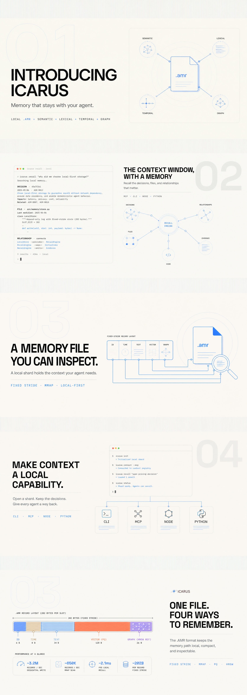

<h1 align="center">ICARUS</h1>

<p align="center">
  <strong>The memory filesystem for AI agents.</strong><br />
  One durable, memory-mapped file per tenant. Rich recall without running another service.
</p>

<p align="center">
  <a href="https://www.npmjs.com/package/singulance-amr"></a>
  <a href="./LICENSE"></a>
  
  
</p>

<p align="center">
  <a href="https://github.com/amar3012005/ICARUS#start-here">Start here</a> ·
  <a href="https://github.com/amar3012005/ICARUS#the-case-for-a-memory-file">Why ICARUS</a> ·
  <a href="https://github.com/amar3012005/ICARUS#what-happens-on-recall">Recall</a> ·
  <a href="https://github.com/amar3012005/ICARUS#use-it-from-your-agent">Agent CLI</a> ·
  <a href="https://github.com/amar3012005/ICARUS#technical-reference">Reference</a> ·
  <a href="docs/HARNESS_QUICKSTART.md">Harness quickstart</a> ·
  <a href="docs/ADAPTER_CERTIFICATION.md">Harness adapters</a>
</p>



---

## The case for a memory file

Most vector databases are designed for document search. Agent memory has a different shape: a
question may need semantic similarity, exact terms, historical validity, and relationship hops at
once. ICARUS keeps that path inside a tenant-owned `.amr` shard instead of spreading it across a
vector service, a relational store, and a graph database.

> **The idea:** make context a local capability. Open a shard, write memories, ask for the right
> context, and keep working—without a server, an account, or a network hop in the critical path.

<table>
  <tr>
    <td width="33%" align="center"><strong>ONE SHARD</strong><br /><sub>A durable per-org memory file and its sidecars.</sub></td>
    <td width="33%" align="center"><strong>FOUR SIGNALS</strong><br /><sub>Semantic · lexical · temporal · graph.</sub></td>
    <td width="33%" align="center"><strong>ZERO SERVICES</strong><br /><sub>Memory-mapped, local-first, ready for an agent loop.</sub></td>
  </tr>
</table>

## Start here

### 01 — Install the agent CLI

On macOS Apple Silicon and Linux x64, this downloads one self-contained binary.

```bash
curl -fsSL https://raw.githubusercontent.com/amar3012005/ICARUS/main/install.sh | bash
```

### Verify a downloaded release

`/update` validates the release checksum before replacing its executable. For a manual download,
verify both the checksum and the build provenance (available for v0.3.60 and later):

```bash
shasum -a 256 -c icarus-darwin-arm64.sha256
gh attestation verify ./icarus-darwin-arm64 -R amar3012005/ICARUS
# Verify the signed SPDX SBOM predicate for the same binary.
gh attestation verify ./icarus-darwin-arm64 -R amar3012005/ICARUS \
  --predicate-type https://spdx.dev/Document/v2.3
```

```bash
# Optional: register ICARUS as an MCP server for available coding agents.
icarus mcp install
```

### 02 — Run the complete demo

The demo opens a shard, stores memories, then recalls the closest context. No API key.

```bash
npm install singulance-amr
node examples/demo-60s.mjs
```

```text
[0.530] the user prefers dark mode in every app
Done in 50ms.
```

## The performance profile

Real `bge-m3` embeddings compared with Qdrant 1.18.2. Every number has a reproduction path—see
[`BENCHMARKS.md`](./BENCHMARKS.md) for machine details, methodology, and limitations.

| Benchmark @ 1M vectors | ICARUS | Qdrant |
|:--|--:|--:|
| Recall latency, top 10 | **1.33 ms** | 2.06 ms via REST |
| Recall quality, recall@5 vs exact | **1.00** | 1.00 |
| Bi-temporal + two graph hops | **1.93 ms** | Multiple calls |
| Storage per memory | **~600 B** | ~4,500 B |
| Vector compression | **32× PQ** | 4× int8 |
| Operational footprint | **one file** | Cluster |

## What happens on recall

```text
your question
     │
     ├── semantic candidates     HNSW / product quantization
     ├── lexical evidence        native BM25
     ├── time constraints        bi-temporal filters
     └── relationship context    two-hop adjacency traversal
                                  │
                                  ▼
                         exact f32 rescore
                                  │
                                  ▼
                          context for your agent
```

The engine keeps the pieces needed for that path in the same mapped shard: fixed-width records,
compressed vectors, LZ4 text, HNSW state, product-quantization codebooks, and graph adjacency.
See [`SPEC.md`](./SPEC.md) for the frozen format and [`THESIS.md`](./THESIS.md) for the design.

## Use it from your agent

The CLI makes a local memory system available to a coding agent immediately.

```bash
# Build an org's local knowledge from a directory.
icarus ingest ./project --org acme

# Find context for an agent task.
icarus recall "Where is authentication decided?" --org acme

# Keep the shard compact and inspect its state.
icarus compact --org acme
icarus status
```

<details>
<summary><strong>What the CLI can do</strong></summary>

| Command | Purpose |
|:--|:--|
| `icarus ingest <dir> --org <name>` | Extract, embed, and store text, Markdown, JSON, CSV, and log files. |
| `icarus recall "<question>" --org <name>` | Run ranked local recall. |
| `icarus mcp install` | Register the MCP server with available coding-agent clients. |
| `icarus compact --org <name>` | Reclaim storage from deleted memories. |
| `icarus status` | Show local shard state. |

</details>

## Govern a coding task

For repository-scale coding work, ICARUS can run as a deterministic harness around an installed
coding agent: immutable contracts, bounded local context, isolated worktrees, executed verification
receipts, and a seal gate. It does not call an LLM itself or turn an agent claim into proof.

```bash
icarus harness init --agent claude
icarus task start --objective "Add scoped authentication" --contract contract.json
icarus context build --task TASK-… --budget 20000 --format markdown
icarus run --task TASK-… --agent claude
```

Read the [Harness quickstart](docs/HARNESS_QUICKSTART.md) before using a managed task, and the
[adapter certification matrix](docs/ADAPTER_CERTIFICATION.md) for the exact current guarantees.

## Use it from Node

```js
const { MnemeVectorStore } = require('singulance-amr');

const store = new MnemeVectorStore({ dataRoot: '~/.icarus/data', dim: 1024 });
await store.upsert('org_acme', [
  { id: 'm1', vector: embed('user prefers dark mode'), payload: { kind: 'preference' } },
]);

const hits = await store.search('org_acme', embed('ui settings'), 5);
// [{ id, score, payload }]
```

ICARUS is a drop-in for the vector layer in Qdrant-style agent stacks. For direct access to the
engine, open a `MnemeStore`, insert a vector, then call `recall`:

```js
const { MnemeStore } = require('singulance-amr');

const shard = MnemeStore.open('~/.icarus/data', 'org_acme', 1024);
shard.insert('user prefers dark mode', new Float32Array(vec), Date.now() * 1e6);
shard.enableHnsw();
const hits = shard.recall(new Float32Array(queryVec), 5);
```

## Use it from Python

The Python binding uses the same Rust core and on-disk format—not a second implementation.

```bash
git clone https://github.com/amar3012005/ICARUS
cd ICARUS/crate/mneme-python
pip install maturin && maturin develop --release
```

```python
from mneme_python import MnemeStore

store = MnemeStore("/path/to/data", "org_acme", dim=1024)
store.insert("user prefers dark mode", embed("user prefers dark mode"), valid_from=0)
hits = store.recall(embed("ui settings"), top_k=5)
```

Python is not published on PyPI yet. The source build above is the supported path; see the
[Python guide](./crate/mneme-python/README.md#install) and [`LIMITATIONS.md`](./LIMITATIONS.md).

## Technical reference

<table>
  <tr><th align="left">Layer</th><th align="left">What it owns</th></tr>
  <tr><td><code>mseg-format</code></td><td>The byte-accurate, spec-locked `.amr` layout.</td></tr>
  <tr><td><code>mseg</code></td><td>Segments, CRUD, compaction, HNSW overlay, and shard lifecycle.</td></tr>
  <tr><td><code>mnsw-index</code></td><td>Thin usearch HNSW wrapper.</td></tr>
  <tr><td><code>mpq</code></td><td>Product quantization, ADC, and drift controls.</td></tr>
  <tr><td><code>mneme-bm25</code></td><td>Shared native BM25 scoring for Node and Python.</td></tr>
  <tr><td><code>mneme-node</code></td><td>N-API binding, CLI, MCP server, and Node vector store.</td></tr>
  <tr><td><code>mneme-python</code></td><td>PyO3 binding plus LangChain and LlamaIndex integrations.</td></tr>
</table>

<details>
<summary><strong>Native lexical search</strong></summary>

ICARUS’s lexical layer is real document-frequency/IDF BM25, shared by both bindings—not a
substring heuristic.

```js
const hits = store.bm25Search('warranty terms', 10);
```

```python
hits = store.bm25_search("warranty terms", top_k=10)
```

Tokenization is language-neutral: lowercase plus a Unicode-alphanumeric split, with no stemming
or stopword list. BM25 results are not layer-filterable yet; see [`LIMITATIONS.md`](./LIMITATIONS.md).

</details>

<details>
<summary><strong>Build and verify from source</strong></summary>

```bash
cd crate
cargo test --workspace
cargo clippy --workspace --all-targets -- -D warnings
bash ../bench/run_p1.sh
```

`cargo test --workspace` runs the Rust workspace suites. The Python extension has its own test
instructions in [`crate/mneme-python/README.md`](./crate/mneme-python/README.md).

</details>

## Honest boundaries

ICARUS is the local storage and retrieval engine. It is **not** a full cognition layer: typed
relationship authoring, entity co-mention resolution, memory versioning, synthesis, and conflict
resolution live above it. That separation is intentional.

For the complete picture, including performance conditions and unfinished work, read
[`LIMITATIONS.md`](./LIMITATIONS.md) before adopting it in production.

---

<p align="center">
  <strong>ICARUS</strong> · local memory infrastructure for agents<br />
  <sub>Built in Rust · exposed through Node, Python, CLI, and MCP · licensed Apache-2.0</sub>
</p>
